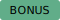

<p align="center">
  
</p>

<h1 align="center"> 
  DSI AI/ML Course <br> 
  Module 1 – How to Git 📝 ⬇️ - Part 2 🤓 </h1>

<p align="center">
    <!-- <div style="font-size:18px; line-height:1.8; margin-bottom:10px;">
    🚀 Day 2 & Day 3: Hands-on Git exercises 🚀
  </div> -->
  🚀 Day 2 & Day 3: Hands-on Git exercises 🚀 <br>
  <a href="#key-note-and-important-concept">Key Notes</a> •
  <a href="https://www.youtube.com/watch?v=iYaQLl0zteA">Fly to Course 25/0730</a> •
  <a href="https://www.youtube.com/watch?v=Urnl03YH6GU">Fly to Course 25/0731/</a> •
  <a href="#situation-room-" style="background-color:#9c4965; color:white; padding:0px 9px; border-radius:4px; font-weight:regular; text-decoration:none;">Situation Room</a> • 
  <a href="#-resource">Resource</a>
</p>

---
## This note covers the exercise on day 2 and day 3 of the Git/Bash Module

## Content

* [Key Note and Important Concept](#key-note-and-important-concept)
* [1. Create a Local Git Repo and Link It to GitHub (Day 2)](#1-create-a-local-git-repo-and-link-it-to-github-day-2)
* [2. Fork a Git Repo from GitHub and Sync to a Local Folder (Day 2)](#2-fork-a-git-repo-from-github-and-sync-to-a-local-folder-day-2)
* [3. Restore a document from other GitHub Repo (Day 3)](#3-restore-a-document-from-other-github-repo-day-3)
* [4. Merge/Pull other document from Git Repo (Day 3)](#4-mergepull-other-document-from-git-repo-day-3)
* [5. Cohort7 -production level madness](#5-cohort7--production-level-madness)
* **[Situation Room 🚨](#situation-room-)**  <--- got stuck? ⚓😣 check here first 
* [Looking for just code, check out the **Git Daily Encounter *✍🏼📗***](/module_1_git/how_to_Git-03_daily_git_encouters-.md)

## System

<div align="left">
  <div style="margin: 2px 0;">
    
    <span style="vertical-align: middle;">Kubuntu-T2 24.04.2 LTS</span>
  </div>
  <div style="margin: 2px 0;">
    
    <span style="vertical-align: middle;">Codename: Noble</span>
  </div>
</div>  

Release:	24.04 LTS  
Kernel Version: Linux 6.14.0-1-t2-noble

---
## Key Note and Important Concept

> [!NOTE]  
> 1. Always run **`git fetch`** before using git log for a log comparison as **`git fetch`** will update your local view of the remote history (without changing your working branch) ----> same for `git push/git pull` as git fetch will update the change.  
> 2. **Basic**: `git fetch ---> git log ---> git push/pull`  
> 3. **Direction matters** for log comparisons. For example, `git log [repo_site_1/branch_a]..[repo_site_2/branch_b]` **➡️ It **only** checks if branch_a is ahead of  branch_b  ➡️ See [Situation 7](#situation-7-check-and-compare-if-there-is-any-difference-between-two-or-more-branches-in-terminal) for details.  
> 4. Want to delete an unwanted repo? Just delete the repo on GitHub (look for the **danger zone** under repo settings in GitHub). After that, trash the local folder 😎  
> 📌 When scrolling inside the `git log` pager, **space** to go forward, **b** to go back, **q** to quit.  
<br>

>  [!IMPORTANT]  
>  1. Use `git status`, `git log`, `git remote -vv`, `git branch -a`, `git branch -vv`, and `git branch -rv` to check the status often - they’re your compass  🧭   
>  ```bash
>    $ git branch -vv # show the connection between local and its link upstream
>    assignment-1 b401131 [origin/assignment-1] Merge pull request no.220 from UofT-DSI/update
>    main         c555065 [origin/main] Merge pull request no.202 from UofT-DSI/update
>   ```  
>
>  2. Git only tracks files. If you upload a file inside a folder from a local repo to the GitHub, the folder will be added to the remote repo -- This is because GitHub doesn’t track **empty folders**. It, however, *remember the path* for the files it tracks  
> 3. Only git log is using **syntax [repo_name/branch]**; other git function will use repo_name branch.  For example: `git log upstream/main` vs. `git push origin main`  
> 4. **Check you head and the branches using `git log`**
> 
>  ```  
>  Terminal Output:
>  ```bash
>  "HEAD -> assignment-two, origin/assignment-two, origin/assignment-one, assignment-one".
>  ```
> In the example above, the HEAD point to assignment-two. There are a total of **four branches**, including assignment-one and assignment-two are two local branches, while origin/assignment-one and origin/assignment-two are two remote branches on GitHub.  
   
 

  

1. Use **`git add .`** to add all the changes in the current folder
2. Use **`git checkout`** to temporary look at the specific commit ----> Good for inspection or temporary testing
  

> [!WARNING]  
> Don’t confuse your **local repo** with your **remote repo** on GitHub. They are two separate worlds.  
> <p align="center">
>     
>   &nbsp;&nbsp;&nbsp;
>   <span style="font-size: 2.5em; font-weight: bold;">VS</span>  
>   &nbsp;&nbsp;&nbsp;
>   
> </p>  
> 

**Disclaimer**: *I have made every effort to ensure the accuracy of this document, but errors may still be present. Feel free to leave comments and I will address them. Thank you!*


<sub>[↥ back to top](#content)&emsp;|&emsp;[Return Main Page 🏠](/README.md) </sub>   

---
## 1. Create a Local Git Repo and Link It to GitHub (Day 2)  
To create a local repo called `test_repo` and linking it to GitHub during the day 2 git in-class exercise: 

```bash
cd path to work            # path to work directory
mkdir test_repo
cd test_repo
git init -b main              # Initialize with main as the default branch
touch test.txt; code test.txt # Create test.txt and open it in VS Code
git status
git add test.txt
git status
git log
git commit
git remote add origin https://github.com/yikai82/test_repo.git
git status
git remote -v
```

<sub>[↥ back to top](#content)&emsp;|&emsp;[Return Main Page 🏠](/README.md) </sub>   

---
## 2. Fork a Git Repo from GitHub and Sync to a Local Folder (Day 2)
Just follow this guide and/or watch the vidoe
- [UofT DSI Submission Guide](https://github.com/UofT-DSI/onboarding/blob/main/onboarding_documents/submissions.md#setting-up)
- [How to Fork a Repository](https://youtu.be/H-8kzcQWJ7U)
- [How to Submit an Assignment](https://youtu.be/gXtxb0ECs2A)

To clone your forked repo into a local folder:

```bash
git clone [repository_url]               # Clone an existing repository
git clone [repository_url] [new_dir]     # Clone and rename the directory
```

<sub>[↥ back to top](#content)&emsp;|&emsp;[Return Main Page 🏠](/README.md) </sub>   

---
## 3. Restore a document from other GitHub Repo (Day 3)
### Background
Someone accidentally delete the avocado from the guacamole recipe, let's fix it. 

📌 **main concept:**  
1. How to create a local branch and push to GitHub in shell. 
2. Restore 

Follow the command below to create a situation:  

```bash 
cd ~/path/to/work/directory # your work directory
git clone https://github.com/dtxe/dsi_guacamole.git # this will create a folder named 'git_gaucamole' under your working directory
cd ./dsi_guacamole.git
git status
git log # you will see two logs and one of them have a comment "Accidentally delete avocados"
ls # list the file
code guacamole.md 

## Here you will see that avocados was deleted by accident so we want to restore
git switch -c fix-avocados e4912279bfddcc05c9c91924cd40efcf04f2f1c3   # create a new branch name 'fix-avocados' to restore the document to its previous time point

# commit id = e4912279bfddcc05c9c91924cd40efcf04f2f1c3
# Use'git log' to retrieve commit id. 

git status

## Fork the dsi_guacamole to your own Git Repo
git remote -v 
git remote rename origin upstream # rename origin to upstream 
git remote add origin https://github.com/yikai82/dsi_guacamole.git  # add new origin 
git remote -v
```

The terminal should have the correct output as below. You will have upstream (point the dtxe) and origin (on your own GitHub):
```bash
origin  https://github.com/yikai82/dsi_guacamole.git (fetch)
origin  https://github.com/yikai82/dsi_guacamole.git (push)
upstream        https://github.com/dtxe/dsi_guacamole.git (fetch)
upstream        https://github.com/dtxe/dsi_guacamole.git (push)
```

Now push the origin to fix-avocados: 
```bash
git push -u origin fix-avocados
git push origin main # if your've forked already, you will have a origin main that you can push if needed
```

Open code to edit the guacamole.md to remove `spicy jalapeno pepper or whatever you want to edit`:
```bash
code guacamole.md
git add guacamole.md; git commit
git status; git log                 # to check the status  
git push fix-avocados
```

<sub>[↥ back to top](#content)&emsp;|&emsp;[Return Main Page 🏠](/README.md) </sub>   

---
## 4. Merge/Pull other document from Git Repo (Day 3)
### Background 
This is an example from the day 3 git course when a document needs to be pulled/merged from different source (big batch), and how to troubleshoot. Just follow the command in the previous session to setup upstream.  Follow the command below to create a situation. This  

```bash
git pull upstream big-batch # since upstream is setup properly, you can pull the branch 'big batch' directly

```

You will see a warning message from terminal if you are on mac/linux: 

```bash
From https://github.com/dtxe/dsi_guacamole
 * branch            big-batch  -> FETCH_HEAD
hint: You have divergent branches and need to specify how to reconcile them.
hint: You can do so by running one of the following commands sometime before
hint: your next pull:
hint: 
hint:   git config pull.rebase false  # merge
hint:   git config pull.rebase true   # rebase
hint:   git config pull.ff only       # fast-forward only
hint: 
hint: You can replace "git config" with "git config --global" to set a default
hint: preference for all repositories. You can also pass --rebase, --no-rebase,
hint: or --ff-only on the command line to override the configured default per
hint: invocation.
fatal: Need to specify how to reconcile divergent branches.
```

Run the following command to merge the conflict document and push:

```bash
# I am not sure which one I was using...' '
git pull --no-rebase upsteram main     
git pull --no-rebase

git status # should indicate there is a conflict 
code guacamole.md  
## You will see your change in the <<<<< HEAD 
## You will see an older change in >>>>>> commit id 
## Click the 'Compare Changes' just on the top of code to see the change
## Accept the change and manually edit what you were planning to do in the 
## previous (i.e., remove spicy)  
git add guacamole.md
git commit 
git push 
```

<sub>[↥ back to top](#content)&emsp;|&emsp;[Return Main Page 🏠](/README.md) </sub>   

---
## 5. Cohort7 - production level madness
### Background
The instructor was simulating a chaos situation where multiple people working on the same document in an industry setting. 

```bash
## clone the cohort7 playground
git clone https://github.com/simeon-demo/cohort7_playground.git
cd cohort7_playground

## waiting for the invitation as collaborator while you can edit the file you like
ls 
git status; git remove -v
git switch -c [branch.name]
code README.md  # just open and edit whatever you like
git add README.md; git commit

## once you have accepted the invitaion as collaborator, you can start push the change
git push # This will push the local branch along with the edit to the github 
git push README.md upstream main # it might no longer work as if the branch was locked
git pull --no-rebase # to solve any conflict if there is any 
git branch -vv
 
```
#### I am totally lost here so... 🚧 🚧 🚧


<sub>[↥ back to top](#content)&emsp;|&emsp;[Return Main Page 🏠](/README.md) </sub>   

---
## Situation Room 🚨

### Situation 1: You mess around a local folder that is tracked by git on GitHub and you desperately want to reset every thing on your GitHub repo 
**Background:** I have a repo on GitHub that is synced with a local folder. I edited the file locally but later I deleted the whole folder on GitHub. Now the local folder and the remote repo on GitHub are no longer in sync because of this conflict. 

*Possible triggers:* 
(1) Deleted a folder (containing files) on a GitHub repo while modifying the same file locally. Now, the GitHub repo it is gone, the local repo says you need to commit and push a change, which you have no place to push. 

**Solution:** (1) **Rename** the local repo to a different name (ex, my repo -> my_repo_delete), (2) **Re-clone** the repo from GitHub using:

```bash
git clone [url] 
```
It will create a new 'my repo" and everything is **reset**. 

<sub>[↥ back to top](#content)&emsp;|&emsp;[Return Main Page 🏠](/README.md) </sub>   

---
### Situation 2: You got an error when you try to pull an update. You are worried that the pull will overwrite your local edited files.
 **Background:** You cloned of someone's repo on GitHub and created a local repo. Then, you also edited a document. You learned that there are new updates from the upstream so you decide to pull. Now you've got an error below. If you pull, you risk overwriting your edited file

```bash
Updating 09ffdf8..6fa9163
error: Your local changes to the following files would be overwritten by merge:
        02_activities/assignments/assignment.sh
Please commit your changes or stash them before you merge.
Aborting
```

*Possible trigger:* You work on the file called assignment1.sh. The new slides are updated in the upstream. It also have an blank assignment.sh. If you pull, you might lose your progress on assignment1.sh

**Solution: (1) Stash local work, (2) Pull from GitHub, (3) Reapply local changes**
**Before doing anything, you can also save the file in a different folder that is not tracked by git.**

```bash
cd ./path/to/your/work/directory
git status                # Check current changes
git remote -v             # View origin and upstream paths
git stash                 # Save local changes
# Check your current branch
git switch main           # Switch to main branch if pushing to main
git switch <branch-name>  # Switch to target branch, if not main
git pull origin main      # Pull changes from GitHub
git stash list            # View saved stashes
git stash pop             # Reapply stashed changes
```

<sub>[↥ back to top](#content)&emsp;|&emsp;[Return Main Page 🏠](/README.md) </sub>   

---
### **📌 Situation 3**: You want the new updates from a upstream to sync to your local and remote repo using Terminal  
**Background:** You forked the DSI/sql and created a branch assignment GitHub already. Then you created a local repo (/path/to/work/sql). From GitHub, you know that both your main branch and assignment branch have new updates. You want the new updates to apply to your local repo and the remote assignment branch. You want to update everything using Terminal. 

**Solution:**

```bash
cd path/to/work/directory/sql
git status                          # it should point to the assignment branch 
git remote -v                       # check the remote setting
git remote add upstream [url]       # set up the upstream
git fetch upstream main
git log origin                      # if no branch name is given, it will output you current HEAD 
git log upstream/main               # upstream/main is where I assigned for the UofT-DSI/sql, 
                                    # need to fetch first to generate log
git log assignment..upstream/main   # this will show if there is any different, 
                                    # if it is return empty, you should be good. 

## If there is difference
git pull upstream main              # you will see conflict message
git pull --no-rebase upstream main  # this will download the update to you local repo 
                                    # and you will not see the conflict message 
git push                            # this will push update from your local repo to your remote repo on GitHub 
```

Share my git log ouput: 
```bash
$ git log
commit c6866b50a78e96433e0079be51356372639bc74a (HEAD -> assignment, origin/assignment)
Merge: 084a71f 47bbd0b
Author: yikai82 <yikai.su89@gmail.com>
Date:   Wed Aug 6 23:06:57 2025 -0400

    Merge branch 'main' of https://github.com/UofT-DSI/sql into assignment

commit 47bbd0b190d5b60ef1f185c2826f3f2e6af787fa (upstream/main)
Merge: e95bd72 b5eb495
Author: CODE, POTATO <t.rose.github@protonmail.com>
Date:   Wed Aug 6 21:43:40 2025 -0400

    Merge branch 'main' of https://github.com/UofT-DSI/sql

commit e95bd72edc7f836762c7c34b2a5776c6a781a7e2
Author: CODE, POTATO <t.rose.github@protonmail.com>
Date:   Wed Aug 6 21:43:34 2025 -0400

    in class code for session 2!

commit 084a71fa2661ef83432ee708fae16928b626b4ef
Merge: 2fc3737 b5eb495
Author: yikai82 <yikai.su89@gmail.com>
Date:   Wed Aug 6 18:14:27 2025 -0400

    Merge branch 'main' of https://github.com/UofT-DSI/sql into assignment
```

### Later, you learn that the branch name 'assignment' needs to be renamed to assignment-one

**Solution:** Rename the branch name on the GitHub, rename the local repo to re-set the link for push/pull

```bash
$ git status # check your HEAD
$ git switch [branch.name]  # move HEAD to branch assignment 
$ git branch -m assignment-one # if you are on branch assignment
# if you are on a differenet branch
$ git branch -m assignment assignment-one
```
### Later, when you try to push again, you encounter the following errors:

```bash                                                                   
fatal: no upstream configured                                             
# or                                                                      
fatal: The upstream branch of your current branch does not match          
the name of your current branch.  To push to the upstream branch....      
```                                                                       

**Solution:**

```bash
$ git branch -vv
  assignment-one b9471f6 [origin/assignment: ahead 4] Merge branch 'main' of https://github.com/UofT-DSI/sql into assignment-one
  main           77afa20 [origin/main] Merge pull request #254 from postatum/patch
# above you will see the assignment-one is set to push/pull to origin/assignment (which does not exist anymore), re-set the link using:
$ git switch assignment-one
$ git push -u origin assignment-one

# Terminal Ourput:
Enumerating objects: 11, done.
Counting objects: 100% (11/11), done.
Delta compression using up to 16 threads
Compressing objects: 100% (6/6), done.
Writing objects: 100% (6/6), 489 bytes | 489.00 KiB/s, done.
Total 6 (delta 5), reused 0 (delta 0), pack-reused 0
remote: Resolving deltas: 100% (5/5), completed with 5 local objects.
To https://github.com/yikai82/sql.git
   b9471f6..9e299a2  assignment-one -> assignment-one
branch 'assignment-one' set up to track 'origin/assignment-one'.
```

<sub>[↥ back to top](#content)&emsp;|&emsp;[Return Main Page 🏠](/README.md) </sub>   

---
### Situation 4: You create a remote clone of with the name 'FUN', and now you want to rename it to 'fun". The Repo FUN also has a local repo 'fun'. The rename is case-senstive and you worry it might trigger errors later 

**Solution: (1)Switch to a different branch temporarily, (2)Rename the branch 'Fun' to [temp-branch], (3) Rename [temp-branch] to 'fun, (4)Delete the old branch 'FUN'**

```bash
git branch -m FUN temp-branch       # Rename to something else temporarily
git branch -m temp-branch fun       # Then rename to final lowercase name
git push origin -u assignment       # Push the new branch to remote and set it to track origin
git push origin --delete FUN        # Delete the old branch from the remote (optional but recommended):
```

---
### Situation 5: You want to pull a remote branch to the local repo that you've setup already. This is a case similar to the big-batch. However, you are also **confused about how many branches you have locally or remotely**

**Solution:**

```bash
git clone [url] # Clone an online GitHub repo to local, the local repo is likely called 'main'
                # From GitHub, you know it has a separate branch 'new-branch 
git pull [origin]/[upstream] [branch.name]  # Depending on the setting, need to define if origin or upstream 
git pull origin -u [branch.name]        # Push the new branch to remote and set it to track origin:
git branch -d [local_branch_name]       # delete unwanted branch      
git branch -v                           # check local branchs
git branch -vv                          # check local branch + more details 
git branch -r                           # check remote branch
git branch -rv                          # check remote branch + more details
```

<sub>[↥ back to top](#content)&emsp;|&emsp;[Return Main Page 🏠](/README.md) </sub>   

----

### **📌 Situation 6:** Reset the HEAD to the previous time point using advance **git log** function
Trigger: You edit a script and realize nothing work so you just want to revert the file to the previous stage (i.e., like the version control in microsoft word or excel)
**Note: The hard reset will erase everything including the commit comment**  

**Solution:**

```bash
git status
git branch -av              # to show all the branch (local and remote)
git log                     # to retrieve the **recent** commit the the current HEAD, 
                            # use git switch to switch branch if needed

## advance git log
git log [repo_site/branch] --since="2025-01-01" --oneline  # This retrieve all the commit since the <date> in one line format.      # need to have oneline as git log is fedault with less format (default to show limited commit)

# if you want the long format 
git --no-pager log [repo_site/branch] --since="2025-01-01"

## To reset 
git branch -vv                # make sure you are in the current branch
git reset --hard [commit#]    # reset HEAD
git push --force              # force the change to the GitHub
```


<sub>[↥ back to top](#content)&emsp;|&emsp;[Return Main Page 🏠](/README.md) </sub>   

---
### **📌 Situation 7**: Check and compare if there is any difference between two (or more) branches in Terminal. 
**Background:** You have a branch called assignment-one. You have pull the new update from the upstream (UofT-DSI/sql). You created a new branch "assignment-two" based on assignment-one on GitHub. Theoretically, the assignment-two should have synced with upstream. You want to confirm everything using Terminal. 

**Solution:**
```bash
cd /path/to/work/directory
git status
git remote -vv      # remote repo + url
git branch -vv      # show local branch name, the latest commit, remote pull/push setup, the lastest commmit message 
git branch -rv      # show remote branch name, the latest commit and the commmit message

## the folowing commands will call the individual log
git log upstream/main
git log origin/assignment-one      
git log origin/assignment-two

git log origin/assignment-two...upstream/main        # compare the difference between assignment-two and upstream/main
## If it returns empty, it mean that assignment-two has caught up the change from upstream/main


## A one-line graph view to visually see whether the two branches have diverged, better than an empty log. 
git log --oneline --graph --decorate     origin/assignment-one origin/assignment-two
```
**Direction Matters:** 
1. ~$ 'git log [target_branch]..[source_branch]' only check if the chagne in 'source branch' is caught up in 'target branch' (i.e., only show commits that are in 'source_branch' but not in 'target_branch'). 2. It does not care about new commits in 'target_branch' that aren’t in 'source_branch'; those don’t make the log show anything.
2. A good practice to see if the log difference between branch_A and branch_B to compare on both direction to capture the difference.  

```bash
git log [branch_A]..[branch_B]
git log [branch_B]..[branch_A]

```

<sub>[↥ back to top](#content)&emsp;|&emsp;[Return Main Page 🏠](/README.md) </sub>   

---
### Situation 8: How to remove an stale (or stealth) branch from you local machine and GitHub
Background: After I renamed branch assignment to asisngment-one and when I ran the branch -vv and branch -rv, I noticed that I still have branch assignment from the output. On my GitHub, there is no branch 'assignment" 

Output: 
```bash
$ git branch -l
assignment    <---- **stale [local] branch**
assignment-one 
assignment-two 
main

$ git branch -rl 
origin/HEAD -> origin/main 
origin/assignment    <---- **stale [remote] branch**
origin/assignment-one 
origin/assignment-two'\033[1m'
```

**Solution:**
```bash
git remote -vv
git branch -vv
git branch -rv
git branch -d assignment            # delete local repo 'assignment'  
git branch -vv; git branch -av      # to confirm local repo 'assignment' does not exist anymore
git push origin --delete assignment # this will push the change to delete the remote branch 'assingment'
git push origin --prune             # this will delte any remote-tracking branch (origin/...) that no longer exists on GitHub.  

```

<sub>[↥ back to top](#content)&emsp;|&emsp;[Return Main Page 🏠](/README.md) </sub>   

---
### ✅ Proper Way to Switch and Track a Remote Branch 

```bash
git fetch [branch_name]
git switch [branch_name]
git branch --set-upstream-to=origin/[branch-name]
git push -u origin [branch_name]
```

---
### 📚 Resources:
1. [U of T DSI GitHub Cheatsheet](https://github.com/UofT-DSI/git/blob/main/01_materials/git_cheatsheet.md)
2. [U of T DSI GitHub/Git](https://github.com/UofT-DSI/sql)
