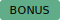

<p align="center">
  
</p>

#
<h1 align="center">
  DSI ML/AI Course <br>
  Module 4.1 &ndash; <i>k</i>&#8209;NN Classification with 🐍  
  </h1>

<p align="center">
  <a href="#key-note-and-important-concept">Key Notes</a> •
  <a href="https://tinyurl.com/5ekh22u6">Fly to Day 1 Recording</a> •
  <a href="https://tinyurl.com/mwc9jdzm">Fly to Day 2 Recording</a> •
  <a href="https://python.datasciencebook.ca/index.html">Textbook</a> •
  <a href="#resources">Resouces</a><br>
  <br>
  **Day 1 live coding started at 1:00 hr mark; Day 2 live coding started at 44:34** <br>
</p>

---
## The content below was covered during WEEK 1 of the CLR session

### Content  
* [Key Note and Important Concept](#key-note-and-important-concept)   
* [1. Cheat Sheet and Play Book](#1-cheat-sheet-and-️️-play-book)
  * [**1.1 Standard workflow** 📕](#11-standard-workflow)
  * [1.2 *k*-NN example: **Wisconsin Breast Cancer** 🧪🔬 ](#12-knn-example-wisconsin-breast-cancer)
* [2. Most Common Used](#2-most-used-libraries-and-functions)
  * [2.1 Libraries](#21-libraries)  
  * [2.2 Python Function RECAP](#22-python-function-recap) 
  * [2.3 Panda/Numpy Functions](#23-pandanumpy-functions)
  * [2.4 scikit-learn Function](#24-scikit-learn-functions)

* [3. 💡 Concept: *k*-Nearest Neighbors Method(*k*-NN)](#2-k-nearest-neighbors-methodknn)  
* [4. 💡 Concept: Model Validation](#4-model-validation) 


---
## System

<div align="left">
  <div style="margin: 2px 0;">
    
    <span style="vertical-align: middle;">Kubuntu-T2 24.04.2 LTS</span>
  </div>
  <div style="margin: 2px 0;">
    
    <span style="vertical-align: middle;">Codename: Noble</span>
  </div>
</div>  

Release:	24.04  
Kernel Version: **Linux 6.14.0-1-t2-noble**

<sub>[↥ back to top](#content)</sub>  

---  
## Key Note and Important Concept:
> [!NOTE]  
> 1. Regression vs Classification  
>     -  **Regression**: to predict **numeric** values ---> *Prediction is an educational guess*.   
>     -  **Classification**: to predict **categorical** values or labels. 
>     - Both Regression and Classification are **supervised** Machine Learning
> 2. Classification: Creates categorical variables or **labels**. 
> 3. Prediction vs Inference  
>     - Prediction:  
>     - Inference:  
> 4. Model Training: Often uses 70% - 75% of the total data as training data. 
>     - Training data contains both training set and validation set. 
>     - Validation set: A test set in the training data.
>     - Typical ratio of **`training set: validation = 0.75: 0.25`** 
>  
> 5. Model evaluation: Only use **test data**, typically uses 30% of the total data ---> See [**Section 4**](#4-model-validation)     
>    - Accuracy:   
>    - Precision: 
>    - Recall: 
>    - Data leakage:       
> 6. Supervise Learning vs Unsupervised Learning.  
>  
> 7. *k*NN: k-Nearest Neighbors:  
>     - ***k***: What is ***k***? What does it mean when ***k***= 1 vs ***k***= 5 or ***k*** = ?---> See [**Section *k*NN**](#3-k-nearest-neighbors-methodknn-️).  
>     - Distance: *k*NN uses a distance metric (e.g., Euclidean, Manhattan, or Murkowski) to calculate the similarity between points.   
>       - **Euclidean** uses the straight line between the two data points --> more suitable for continuous variables.   
>       - **Manhattan** calculates the block distance --> more suitable for ordinal data.      
>    - ⚠️ **Limitation**: Sensitive to missing value --> *k*NN requires access to all values in the training data.      
> 8. Data Validation:
>     - **Cross-Validation**: keep each set of training set a chance to be a validation set --> See [**Section 4**](#42-cross-validation).
> 9. Data Standardization: centering, scaling ---> See [**Section 3**](#32-variable-standardization).
> 
> 10. Imbalance: occurs when one label is much more common than another in a dataset. This is due to *k*NN method inherent a bias from its **majority rules**.  
**Note**: No consensus on for the ratio. For classifying into 2 variables: 90:10 or 80:20 can be considerred imbalance.
>     


> [!IMPORTANT]  
> 1. [**K-nearest neighbors**](#2-k-nearest-neighbors-methodknn-️) is widely used but not the only method. There are other methods for classification such as *decision trees, support vector machines (SVMs), logistics regression, neural networks*.   
> 2. **Model Evaluation**: ---> [Confusion Matrix]() 
>      
> 3. `StandardScaler()`: Performs standardization independently for each feature (column). For the Workflow, see [Section ](#14-scikit-learn).   
>     - In a normal distribution, the max/min is 3, so if the value is somewhere between +- 3 for an entire column that’s a good way to tell the data is standardized. 
>
> 4. `train_test_split()`: Splits the data into training data and testing data. 
>     - **Stratify**: Keeps the same proportions of categories (or classes) in your splits as in the full dataset 💡. --> See [**Section 1.4 scikit-learn/`train_test_split`**](#train_test_split)  
>    
> 5. Set random seed: When splitting the data between training data and testing data, it is crucial to set random seed. Make sure run `np.random.seed()` before `train_test_split()` --> See [Here](#train_test_split)
>    
> 6. `cross_validate()`: See [Here](#cross-validation)
> 7. `GridSearchCV()`: help to identify the best K value and hold on to it. You dont need to set k = n  
> 8. **Missing Data**: is very common and is challenging. Most time, it requires SME to know the data, setting, and collection method.  
>    - Can be **informative**, should not be ignored 
>    - *k*NN requires access to the all values in the training data 
>    - *k*NN with handling the missing data: (1) remove; (2) estimate --> the common method is **mean imputation**, which assumes the missing data is **random**     


> [!WARNING]  
> 1. ***k*NN classification is based on distance calculation** so the inputs need to be numeric and cannot handle missing value --> check if all the data points are **non-NULL.** 
> 2. Do **not** use the test set during tuning. *Tuning is part of model training, not model evaluation*.
> 3. `df_name_new = df_name_ori` creates alias for the dataframe. To copy a new dataframe, use `_.copy()`.
> 4. 🚨 **Mean imputation** works well **only if** the missing data is random and small size. Moreover, severely reduce the spread could lead to misinterpret the source information and can have significant impact on the accuracy. 

<br>  

**Disclaimer**: *I have made every effort to ensure the accuracy of this document, but errors may still be present. Feel free to leave comments and I will address them. Thank you!*

<sub>[↥ back to top](#content)</sub>

---
  

1. How to work with **categorical** or **mixed** data (both numeric and categorical) for Classification? 

<sub>[↥ back to top](#content)</sub>

---
## 1. Cheat Sheet and ⚔️🛡️ PLAY BOOK 

### 👉🏼 Click the link here to fly to [LCR master cheat sheet and Play Book](/module_4_Ln%20+%20Class%20+%20Resample/DSI-LCR01_master_cheat_sheet..md)


### 1.1 Standard workflow 

1. Import data and inspect data
2. Standardization and data split using `StandardScaler()` + `train_test_split()`
3. k parameter tuning using `GridSearchCV()`
4. `kNN.fit` and `kNN.predict` by initiate `knn = KNeighborsClassifier(*k_tuned*)`
5. Model evaluation using confusion matrix, accuracy, precision, recall. See [Section 4](#4-model-validation)
6. Inspect the result with K-Nearest Neighbors Performance Plot or other alternatives 


<sub>[↥ back to top](#content)</sub>

---
### 1.2 *k*NN example: Wisconsin Breast Cancer

```python
## Import library
import pandas as pd
import numpy as np
from IPython.display import display

# for scikit-learn
from sklearn.preprocessing import StandardScaler
from sklearn.model_selection import train_test_split, cross_validate, GridSearchCV
from sklearn.neighbors import KNeighborsClassifier
from sklearn.metrics import accuracy_score, recall_score, precision_score
from sklearn import datasets as ds

# for plot
import matplotlib.pyplot as plt
import matplotlib.colors as mcolors


### >>> 1. Data Import and Preprocess <<< ### 

# import data
cancer = ds.load_breast_cancer()
cancer_df = pd.DataFrame(cancer.data, columns=cancer.feature_names)
cancer_df['diagnosis'] = cancer.target

# Check the data type of the Series content
print("Data type of diagnosis column:", cancer_df['diagnosis'].dtype)
print("First few values:", cancer_df['diagnosis'].head().tolist())
print("Unique values:", cancer_df['diagnosis'].unique())
display(cancer_df.head(20))

##.replace() only works with str not int
#$  use map to replace numbers with str, This cell block shoule  only run once as it will keep mapping.
cancer_df['diagnosis'] = cancer_df['diagnosis'].map(
    {0 : 'Malignant',
     1 : 'Benign'})

cancer_df.info()

# check if data is imbalance
cancer_df["diagnosis"].value_counts(normalize= True)

### >>> 2. Standardize with numeric and Data Split  <<< #### 
np.random.seed(1)
cancer_stdz = cancer_df.copy()
cancer_stdz2 = cancer_df.copy()

## There are two ways of doing this :
# (a) use col_to_scale  
col_to_scale = cancer_stdz.columns[:len(cancer_stdz.columns)-1]
scaler = StandardScaler()
cancer_stdz[col_to_scale] = scaler.fit_transform(cancer_stdz[col_to_scale])
display(cancer_stdz)

# (b) use .selecct_dtypes() and .difference() method
col_to_exclude = cancer_stdz2.select_dtypes(exclude= 'number').columns # kNN classification only works with numbers
col_to_scale2 = cancer_stdz2.columns.difference(col_to_exclude)
scaler2 = StandardScaler()
cancer_stdz2[col_to_scale2] = scaler2.fit_transform(cancer_stdz2[col_to_scale2])

print(f"Data frame 'cancer_stdz' equal to 'cancer_stdz2 : {cancer_stdz.equals(cancer_stdz2)}")

# data split 
cancer_train, cancer_test = train_test_split(cancer_stdz, train_size= 0.75, stratify= cancer_df['diagnosis'])


### >>> 3. Initiate kNN Model to search for the best k <<< ### 
knn = KNeighborsClassifier()
par_grid = {'n_neighbors' : range(1,201,3)}
cancer_grid = GridSearchCV(knn, par_grid, cv= 10, verbose = 1 )

X = cancer_train[["mean perimeter","mean concavity"]]; Y = cancer_train["diagnosis"]
cancer_grid.fit(X,Y)
accuracy_grid =pd.DataFrame(cancer_grid.cv_results_)
display(accuracy_grid)
k_tuned = cancer_grid.best_params_.get('n_neighbors')
print('\n' 'The best result is when k =' f"{k_tuned}")

### >>> 4. Model Fitting and Prediction <<< ###
knn = KNeighborsClassifier(k_tuned)
knn.fit(X, Y)

cancer_test["predicted"] = knn.predict(cancer_test[["mean perimeter","mean concavity"]])
display(cancer_test[["diagnosis","predicted"]].head(10))


### >>> 5. Model Evaluation <<< ###
# Confusion Matrix 
table = pd.crosstab(cancer_test["diagnosis"],
            cancer_test["predicted"],
            rownames= ["Actual"],
            colnames=["Predicted"])
print('\n' f"{table}")

accuracy = np.round(accuracy_score(cancer_test["diagnosis"],cancer_test["predicted"]),4)
precision = np.round(precision_score(cancer_test["diagnosis"], cancer_test["predicted"], pos_label= "Malignant"),4)
recall = np.round(recall_score(cancer_test["diagnosis"], cancer_test["predicted"], pos_label = "Malignant"),4)
print('\n The accuracy is ' f"{accuracy}")
print('\n The precision is ' f"{precision}")
print('\n The recall is ' f"{recall}")


### >>> 6. Create a K-Nearest Neighbors Performance Plot <<< ### 
plt.figure(figsize=(10, 6))
# Plot mean test scores with error bars
plt.plot(accuracy_grid['param_n_neighbors'], accuracy_grid['mean_test_score'], '-o', color='blue')

# Add labels and legend
plt.xlabel('Number of Neighbors')
plt.ylabel('Accuracy estimate')
plt.title('K-Nearest Neighbors Performance')
plt.tight_layout()
plt.show()

```

<sub>[↥ back to top](#content)</sub>

--- 

## 2. Most Used Libraries and Functions

### 2.1 Libraries: 

1. Pandas: [User Guide](https://pandas.pydata.org/docs/user_guide/index.html)

2. NumPy: [User Guide](https://numpy.org/doc/stable/user/index.html#user)

3. Random: The Python random module provides functions for generating pseudo-random numbers and performing random selections or manipulations of sequences. It is a built-in module, meaning it does not need to be installed separately, only imported.

4. Scikit-learn: One of the most popular open-source Python libraries for machine learning. It builds on top of NumPy, SciPy, and Matplotlib and provides a unified, easy-to-use set of tools for:
    - **Classification** (e.g., SVM, logistic regression, random forests)
    - **Regression** (e.g., linear regression, ridge, lasso)
    - **Clustering** (e.g., k-means, DBSCAN)
    - **Dimensionality reduction** (e.g., PCA)
    - **Model selection** (e.g., cross-validation, grid search)
    - **Preprocessing** (e.g., scaling, encoding, feature extraction)


<sub>[↥ back to top](#content)</sub>  

---
### 2.2 Python Function RECAP

1. **`__.replace({'x' : 'new_x', 'y', 'new_y'})`**: Replaces a specified phrase with another specified phrase. To look up, type `help(str.replace)`.  

    

    ```python
    # example 1
    txt = "one one was a race horse, two two was one too."
    x = txt.replace("one", "three")
    print(x)
    
    # example 2
    cancer["diagnosis"] = cancer["diagnosis"].replace({'M':'Malignment','B':'Benign'})
    ```


2. `range(start_num, end_num, interval)`


<sub>[↥ back to top](#content)</sub>

---
### 2.3 Panda/Numpy Functions 

1. **`pd.read_csv('/path/to/file')`**: Reads csv file.
    - '/' indicate from root (/) as absolute path. For simplicity, suggest to place data files in the folder >>> `pdf.read_csv(folder/file)`.  

2. **`pd.DataFrame`**: 

3. **`__.info()`**: Provides a concise summary of a DataFrame, including the dtype, column names, and non-null values.  

4. **`__.columns`**: Returns the label of each column in the DataFrame.  
    - `df.columns[x]`: returns the label of column from *df* at the index x. 
    - **`df.columns[0:len(df.columns)-1]`**: returns all the label of column except the last one from *df*.  
   
     **⚠️ Note: Python is 0 index**

5. `df[["col_1","col_2","col_3,..."]]`: Asks pandas extract the data of specific columns from a DataFrame.

    ```python
    cancer[["diagnosis", "perimeter_mean", "concavity_mean"]]
    ```
    - cancer[...]this is indexing into the DataFrame (like slicing in R).
    - The inside ["diagnosis", "perimeter_mean", "concavity_mean"] is a Python list of column names.
    - So you’re telling Pandas: “give me a new DataFrame containing just these 3 columns.”  

    **Note**:  
    - dataframe["col_1"] --> returns a Series (1D, like a vector in R).  
    - dataframe[["col_1"]] -->  still returns a DataFrame (2D, like a mini table).  


6. **`.dtype`/`.dtypes`**:
    - dtype: Returns a dtype from **1D array**, a **NumPy array**, or a **single DataFrame column** (Series), like int64, float64, object, etc
    - dtypes: Returns a Series mapping column names to their dtypes  

    **Note**: The difference:.dtype is an attribute, np.dtype() is a class/constructor. That’s why examples on the help(np.dtype) page felt unrelated.


7. `__.astype()`: Casts a pandas object to a specified dtype.

8. `__.select_dtype().columns`: Returns a DataFrame with columns of selected data types

9. `__.columns.difference()`: Uses together with select_dype().column to exclude specific dtype for the selected columns 

   
     
    ```python
    ## WBC exammple:
    col_to_exclude = cancer_stdz2.select_dtypes(exclude= 'number').columns # kNN classification only works with numbers
    col_to_scale2 = cancer_stdz2.columns.difference(col_to_exclude)
    scaler2 = StandardScaler()
    cancer_stdz2[col_to_scale2] = scaler2.fit_transform(cancer_stdz2[col_to_scale2])
    ```

10. **`__.unique()`**: Returns unique values based on a *hash table*. Uniques are returned in order of appearance. This does NOT sort. A **hash table** is dictionary date type that data are stored in key-value pairs --> Day 2 recording at 01:02:53.  

11. **`__.value_counts()`**: Returns the number of unique rows --> For categorical variables  

    
     
    ```python
    # Example 1: 
    np.random.seed(10)
    a = np.random.randint(1, 10, size = (3, 4)) # create a random 3 x 4 array from int 1 to 10
    a.dtype

    # Example 2: 
    wine_data = load_wine()
    wine_df = pd.DataFrame(wine_data.data, columns=wine_data.feature_names)
    wine_df['class'] = wine_data.target     # Bind the 'class' (wine target) to the DataFrame
    print(f'The data type is {wine_df["class"].dtype}'), 
    print(f'THe levels are {wine_df["class"].unique()}.')

    wine_df["class"] = wine_df["class"].astype(str) # type convert
    wine_df["class"].value_counts(sort= False)
    ```


<sub>[↥ back to top](#content)</sub>  
<br>

12. `df.iloc[]`: Use help() and type `pd.DataFrame.iloc` for more information

13. **`__.nsmallest(n,"column_name")`**/**`__.nlargest(n,"column_name")`**: Returns a specified number of rows for a specified column (`"column_name"`) by sorting from the  **smallest**/**largest** values [[]].  
    - Use `[[.....]]`to specify the output column if needed  
  
14. `__.head(n)`/`__.tail(n)`: Returns a specified number of rows (**`n`**),strings from the top. Default n =  

15. `__.copy()`: Returns a copy of the data frame. 

16. `np.random.seed(x)`
    ```python
    random.seed(11)
    np.random.seed(11)

    print(random.random())
    print(np.random.rand())
    ```
  
17. `__.values`: Returns the DataFrame as a NumPy array   
  
18. `__.groupby()`: Allows you to group your data and execute functions on these groups.  
  
19. **`pd.crosstab()`**: Compute a simple cross tabulation of two (or more) factors, such as confusion matrix 
    - pd.crosstab(index, columns, values=None, rownames=None, colnames=None, aggfunc=None, margins: 'bool' = False, margins_name: 'Hashable' = 'All', dropna: 'bool' = True, normalize: "bool | Literal[0, 1, 'all', 'index', 'columns']" = False)
      - index : array-like, Series, or list of arrays/Series Values to group by in the rows.
      - columns : array-like, Series, or list of arrays/Series Values to group by in the columns.
      - values : array-like, optional. Array of values to aggregate according to the factors. Requires `aggfunc` be specified.
      - rownames : sequence, default None. If passed, must match number of row arrays passed.
      - colnames : sequence, default None. If passed, must match number of column arrays passed.
      - aggfunc : function, optional. If specified, requires `values` be specified as well.
      - margins : bool, default False. Add row/column margins (subtotals).
      - margins_name : str, default 'All' Name of the row/column that will contain the totals
        when margins is True. 
      - dropna : bool, default True. Do not include columns whose entries are all NaN.
      - normalize : bool, {'all', 'index', 'columns'}, or {0,1}, default False. Normalize by dividing all values by the sum of values.

<sub>[↥ back to top](#content)</sub> 

---
### 2.4 scikit-learn Functions

1. #### `set_config`: allows configuring global setting
    - `set_config(transform_output='pandas')`: Sets scikit-learn default output as data frames 

2. #### `scaler = StandardScaler()`: 
    - `scaler.fit_transform(X, y=None, **fit_params)`: Fits transformer to `X` and `y` with optional parameters `fit_params` and returns a transformed version of `X_new`.
    - X : array-like of shape (n_samples, n_features).Input samples.
    - y : array-like of shape (n_samples,) or (n_samples, n_outputs), default=None
    - Returns : X_new : ndarray array of shape (n_samples, n_features_new). Transformed array.
    - [Check here for more info](https://www.w3schools.com/python/python_ml_scale.asp).  

    <br>  

    

    ```python
    # Example 1
    scaler = StandardScaler()   # initialize the scaler
    cancer_stdz[col_to_scale] = scaler.fit_transform(cancer_stdz[col_to_scale])
    cancer_stdz

    # Example 2
    import pandas
    from sklearn import linear_model
    from sklearn.preprocessing import StandardScaler
    scale = StandardScaler()
    df = pandas.read_csv("data.csv")
    X = df[['Weight', 'Volume']]
    scaledX = scale.fit_transform(X)
    ```

<sub>[↥ back to top](#content)</sub> 

---
3. #### `train_test_split()`  
    - Split arrays or matrices into **random** train and test subsets.   
    - **Make sure set random seed (`np.randome.seed`) before run it, so the result can be compared** 
    - `train_test_split(*arrays, test_size=, train_size=None, random_state=None, shuffle=True, stratify=None)` 
      * arrays : sequence of indexables with same length / shape[0] Allowed inputs are lists, numpy arrays scipy-sparse matrices or pandas dataframes.      
      * test_size : float or int, default=None.    
      * train_size : float or int, default=None. If float, should be between 0.0 and 1.0 and represent the
          proportion of the dataset to include in the train split.
      * random_state : int, RandomState instance or None, default=None.
      * shuffle : bool, **default=True**.
      * stratify : array-like, default=None. If not None, data is split in a stratified fashion, using this as the class labels. Read more in the :ref: `User Guide <stratification>`.

      <br>  

      

    ```Python
    df_train,df_test = train_test_split(df, train_size= 0.75, stratify= df["col_name"])
    ``` 
    
<sub>[↥ back to top](#content)</sub> 

---
4. #### `GridSearchCV()`  
    - Exhaustive search over specified parameter values for an estimator. Important members are fit, predict.
    - `GridSearchCV(estimator, param_grid, *, scoring=None, n_jobs=None, refit=True, cv=None, verbose=0, pre_dispatch='2*n_jobs', error_score=nan, return_train_score=False)`  > similar argument to `cross_validate()`
      * **estimator** : estimator object
      * **param_grid** : dict or list of dictionaries
      * scoring : str, callable, list, tuple or dict, default=None | Strategy to evaluate the performance of the cross-validated model on the test set.
      * n_jobs : int, default=None | Number of jobs to run in parallel
      * **cv** : int, cross-validation generator or an iterable, default=None  
      * verbose : int | Controls the verbosity: the higher, the more messages.  
         ->1 : the computation time for each fold and parameter candidate is displayed;   
         ->2 : the score is also displayed;  
         ->3 : the fold and candidate parameter indexes are also displayed together with the starting time of the computation.   
      * pre_dispatch : int, or str, default='2*n_jobs'  
      * error_score : 'raise' or numeric, default=np.nan  
      * return_train_score : bool, default=False

<sub>[↥ back to top](#content)</sub> 

---
5. #### `KNeighborsClassifier()`:
    - `knn = KNeighborsClassifier(k)`: Sets k, which represents the number neighbors to look at when classifying/regressing a new point.
    - `knn.fit()` : Fits the data and trains a *k*NN model 
    - `knn.predict()`: uses the trained model to predict the labels for new data.
    - `knn.kneighbors()`: Finds the K-nearest neighbors for a given set of data points in a fitted K-Nearest Neighbors (*k*NN) model.  
    - **`knn.score(X, y, sample_weight=None)`**: Returns the mean accuracy on the given test data and labels.  
      * X : array-like of shape (n_samples, n_features), or None Test samples. 
      * y : array-like of shape (n_samples,) or (n_samples, n_outputs) True labels for `X`.
      * sample_weight : array-like of shape (n_samples,), default=Non  

       
    - **KNeighborsClassifier**: 
      - Purpose: predict labels directly (classification). Great if you just want kNN as your model.
      - Has __.fit(), __.predict(), __.predict_proba().
      - End-to-end solution — you give it X_train, y_train, and later it tells you the class of new_obs.

    - **KNeighborsTransformer**
      - Purpose: convert data into a “neighbors graph” (matrix of who’s close to who).
      - Has __.fit_transform() and __.transform(), but no __.predict().
      - Usually used inside a pipeline, for example:
      - As input to another classifier (e.g., Logistic Regression, SVM).
      - As preprocessing before clustering or graph-based models.
      - More flexible if you’re experimenting with advanced workflows.  
      <br>  

    
    * [***k*NN Classification with Wine**](#12-knn-example-wine-classification)

      ```python
      knn = KNeighborsClassifier(7)   # initiate an kNN object 
      knn.fit(training_set[predictor_col],  # kNN model fitting 
              training_set[response])
      
      testing_set["predicted"] = knn.predict(wine_test[predictor_col])
      testing_set["true_Y","predicted"]
      ```
    

<sub>[↥ back to top](#content)</sub>

---
6. #### Accuracy, Precision, Recall 
    - Definition: [Here](#41-confusion-matrix)
    - `accuracy_score(y_true, y_pred, normalize = True, sample_weight=None)`: computes subset accuracy:
      * y_true : 1d array-like
      * y_pred : 1d array-like
    - `precision_score(y_true, y_pred, *, labels=None, pos_label="str", average='binary', sample_weight=None, zero_division='warn')`: computes the precision  
      * **pos_label: str** | int = 1,  <--- need to specificed
    - `recall_score(y_true, y_pred, *, labels=None, pos_label=1, average='binary', sample_weight=None, zero_division='warn')`: compute the recall.   
      * y_true : 1d array-like, or label indicator array / sparse matrix
      * y_pred : 1d array-like, or label indicator array / sparse matrix
      * labels : array-like, default=None
      * **pos_label : int, float, bool or str**, default=1
      * average : {'micro', 'macro', 'samples', 'weighted', 'binary'} or None, default='binary'
      * sample_weight : array-like of shape (n_samples,), default=None
        Sample weights.
      * zero_division : {"warn", 0.0, 1.0, np.nan}, default="warn"


<sub>[↥ back to top](#content)</sub> 

---
7. #### Cross-Validation  
    - Evaluate metric(s) by cross-validation and also record fit/score times. Return data type **dictionary**
    
    - The cross_validate() does not require to set the random seed.

    - `cross_validate(estimator, X, y=None, *, groups=None, scoring=None, cv=None, n_jobs=None, verbose=0, params=None, pre_dispatch='2*n_jobs', return_train_score=False, return_estimator=False, return_indices=False, error_score=nan)`  

      * **`estimator`** : estimator object implementing 'fit' | The object to use to fit the data.

      * **X** : array-like, sparse matrix} of shape (n_samples, n_features). The data to fit.

      * **y** : array-like of shape (n_samples,) or (n_samples, n_outputs), default=None. | The target variable to try to predict in the case ofsupervised learning.

      * groups : array-like of shape (n_samples,), default=None | Group labels for the samples used while splitting the dataset into train/test set. Only used in conjunction with a "Group" :term:`cv` instance (e.g., :class:`GroupKFold`).

      * `scoring` : str, callable, list, tuple, or dict, default=None | Strategy to evaluate the performance of the cross-validated model on the test set. See :ref:`multimetric_grid_search` for an example.

      * **`cv`** : int, cross-validation generator or an iterable, default=None | Determines the cross-validation splitting strategy. Possible inputs for cv are:   
        - None, to use the **default 5-fold** cross validation,
        - int, to specify the number of folds in a `(Stratified)KFold`,
        - :term:`CV splitter`,
        - An iterable yielding (train, test) splits as arrays of indices.
        - Refer :ref:`User Guide <cross_validation>` for the various cross-validation strategies that can be used here.

      * n_jobs : int, default=None | Number of jobs to run in parallel. Training the estimator and computing the score are parallelized over the cross-validation splits.
         - ``None`` means 1 unless in a :obj:`joblib.parallel_backend` context.
         - ``-1`` means using all processors. 
         - See :term:`Glossary <n_jobs>` for more details.

      * verbose : int, default=0 | The verbosity level.

      * params : dict, default=None | Parameters to pass to the underlying estimator's ``fit``, the scorer,
        and the CV splitter.
        
      * pre_dispatch : int or str, default='2*n_jobs'
        
      * return_train_score : bool, default=False 
        
      * return_estimator : bool, default=False | Whether to return the estimators fitted on each split.

      * return_indices : bool, default=False | Whether to return the train-test indices selected for each split.

      * error_score : 'raise' or numeric, default=np.nan | Value to assign to the score if an error occurs in estimator fitting. 

<sub>[↥ back to top](#content)</sub> 

--- 
8. `df.agg()`: Allows to apply a function or a list of function names to be executed along one of the axis of the DataFrame, default 0, which is the index (row) axis.
  - `df.agg(self, func=None, axis: 'Axis' = 0, *args, **kwargs)`  
  <br>  

  

  ```python    
  data = {"x": [50, 40, 30], "y": [300, 1112, 42]}
  df = pd.DataFrame(data)
  output = df.agg(["sum","mean"])
  output
  ```
      
<sub>[↥ back to top](#content)</sub> 

---
## 3. K-nearest Neighbors Method(*k*NN) 🗳️ 

### 3.1 Concept  

1. *k*NN is a simple, supervised machine learning (ML) algorithm that can be used for classification or regression tasks.It finds the "nearest" or "most similar" observations in the training set to predict a new observation's label.---> majority vote!! 🗳️  
   - **"Closest"** can be measured by calculating the straight-line between points, known as distance.  
   - **Sensivity**  
   - K is a predefined number of neighbors considered for classification.   
     - K = 1 ---> 
     - K = 5 --> default in KNN library
     - K = 300 ---> 
2. Overfitting vs Underfitting ---> [Day 2 video](https://tinyurl.com/mwc9jdzm) at 31:35(m:ss).
   - **Overfitting**: When predicting a response, the model fails to incorporate necessary information which causing the prediction is very sensitive to the data **Tip: Think about K=1 is predicting outcome only consider the nearest single data point**
   - **Underfiting**: oversimplify and *fail the capture the underlying pattern*, as the result the prediction will be based on majority as it just guess the most common answer. **Tip: Everyone gets to vote**s  

3. To classify a new observation with K-nearest neighbors, follow these steps:  
   (1). Determine the nearest observation to the new observation from the training set.  
  
   (2). Identify the K observations that are closest.    

   (3). Classify the new observation based on the most common class among these neighbors.  


<sub>[↥ back to top](#content)</sub> 

---  
### 3.2 Variable Standardization 

1. In K-nearest neighbors classification, the **scale (distance)** of each variable affects predictions.  

2. Variables with larger scales (e.g., salary) have a bigger impact on distance calculations than variables with smaller scales (e.g., years of education).  

    - This means that variables with large scales might dominate the prediction process.  
    - *Example: a $1000 difference in salary affects distances more than a 10-year difference in education. However, in reality, 10 years of education might be more significant for predicting job type than a $1000 difference in salary.*  
    - **Scaling***: To ensure fair contribution from all variables, we performa **standardization** to scale and center data before entering it into the model:  
    
      --> Find The difference between the observation and mean (μ) and divide it by the standard deviation (σ) for each value.  
      
    - This standardization adjusts the data so each variable has a mean of 0 and a standard deviation of 1, allowing the model to consider each variable equally based on its relationship to the outcome rather than its scale.
    
3. Imbalance

4. Missing Data day 1 [53:00]  

5. More than 3 variables - day 1 [54:30]   


<sub>[↥ back to top](#content)</sub> 

---
## 4. Model validation

### 4.1 Confusion Matrix

<br>
<table style="border-collapse: collapse; font-family: Arial, sans-serif; text-align: center;">
  <tr>
    <th style="border: 2px solid #8a8a8a; background:#333333; color:#fff; padding:8px;"></th>
    <th style="border: 2px solid #8a8a8a; background:#333333; color:#fff; padding:8px;">Predicted Malignant</th>
    <th style="border: 2px solid #8a8a8a; background:#333333; color:#fff; padding:8px;">Predicted Benign</th>
  </tr>
  <tr>
    <th style="border: 1px solid #8a8a8a; background:#333333; color:#fff; padding:8px; text-align:left;">Actually Malignant</th>
    <td style="border: 1px solid #8a8a8a; background:#333333; color:#fff; padding:8px;">✅ True Positive (TP)</td>
    <td style="border: 1px solid #8a8a8a; background:#333333; color:#fff; padding:8px;">❌ False Negative (FN)</td>
  </tr>
  <tr>
    <th style="border: 1px solid #8a8a8a; background:#333333; color:#fff; padding:8px; text-align:left;">Actually Benign</th>
    <td style="border: 1px solid #8a8a8a; background:#333333; color:#fff; padding:8px;">❌ False Positive (FP)</td>
    <td style="border: 1px solid #8a8a8a; background:#333333; color:#fff; padding:8px;">✅ True Negative (TN)</td>
  </tr>
</table>
<br>


     

  |                       | Predicted	Benign	| Predicted Malignment |  
  |-----------------------|-------------------|----------------------|  
  |Actual Benign	        | 84	              | 6                    |  
  |Actual Malignment	    | 5	                | 48                   |  

Calculation:  
- Accuracy = (84+48)/total   
- Precision (How much % positive are truly positive)= 48/(6+48)     
  **Inferential sense: How much % false positive do we have?**  
  - **FDR (False Discovery Rate)** = 1 - Precision  
- Recall (How much % positive we capture from the total true positive) = 48/(5+48)  
  **Inferential sense: How much positive we miss (false negative)**   
  - **Error Rate** = 1 - Recall 

<br>    

<sub>[↥ back to top](#content)</sub> 

---
### 4.2 Cross Validation
 - **WHY**: If only test once, the outcome is sole dependent on the validation set that is used for tunning and the split is randomness. ---> When rotating the data set, it increases the robustness. 
 - Step:
    1. Create multiple classifiers by varying parameter values and splitting data into multiple subsets or "folds." 
    2. Evaluate each classifier on validation results to determine the best parameter value. 
    3. Instead of random splits, use a more systematic approach where each observation is in a validation set only once.  
      i. Split the training data into evenly sized chunks.  
      ii. Iteratively use one chunk as the validation set and the remaining chunks as the training set.  
    4. This ensures that each observation is used for validation exactly once and for training $C - 1$ times.


<sub>[↥ back to top](#content)</sub> 

## Resources
1. [U of T DSI/LCR Repository](https://github.com/UofT-DSI/LCR?tab=readme-ov-file)
2. [W3School Pandas - DataFrame Reference](https://www.w3schools.com/python/pandas/pandas_ref_dataframe.asp)
3. [Python Documentation](https://docs.python.org/3/index.htm)
4. [Pandas: User Guide](https://pandas.pydata.org/docs/user_guide/index.html)
5. [NumPy: User Guide](https://numpy.org/doc/stable/user/index.html#user)

